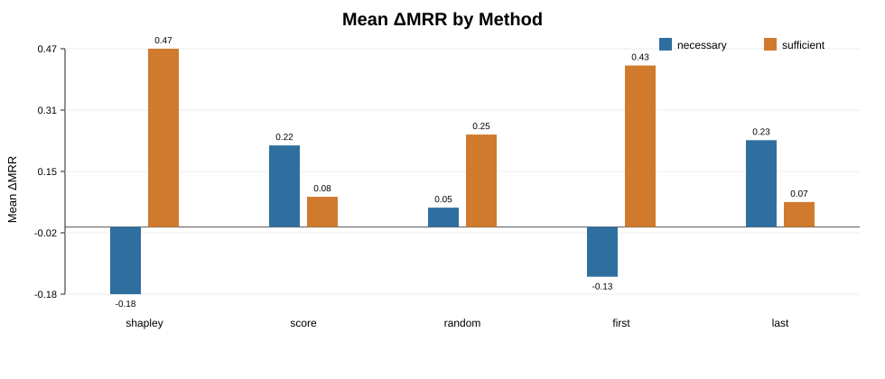
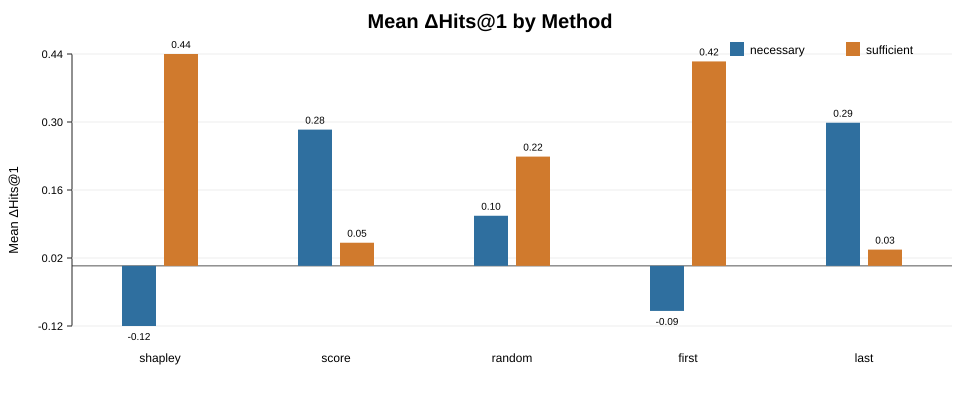
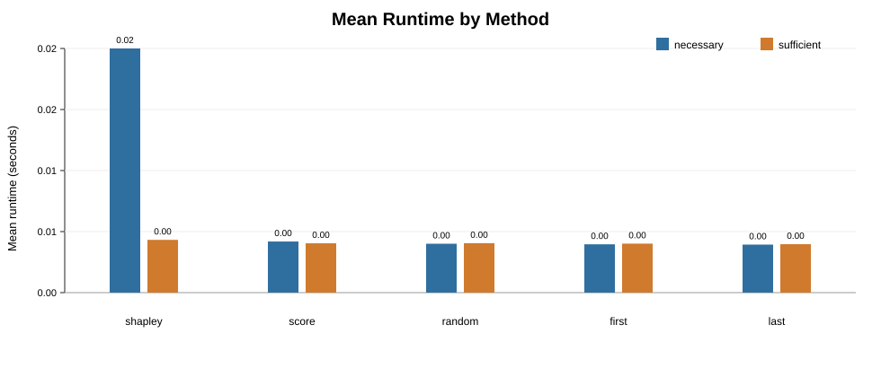

# Báo cáo thực nghiệm CQD-SHAP

## 1. Mục tiêu

Báo cáo này tổng hợp kết quả thực nghiệm CQD-SHAP trên bộ dữ liệu Freebase, Benchmark 1, query type `2p`. Mục tiêu là so sánh phương pháp `shapley` với các baseline `score`, `random`, `first`, và `last` trong hai kịch bản đánh giá:

- **Necessary explanation**: kiểm tra mức độ quan trọng của atom được chọn bằng cách loại bỏ/đảo trạng thái atom đó và đo độ giảm hiệu quả truy vấn.
- **Sufficient explanation**: kiểm tra liệu atom được chọn có đủ để duy trì hoặc khôi phục hiệu quả truy vấn hay không.

## 2. Thiết lập thực nghiệm

- Knowledge graph: `Freebase`
- Benchmark: `1`
- Query type: `2p`
- Model: `FB15k-237-model-rank-1000-epoch-100-1602508358.pt`
- Phương pháp: `shapley`, `score`, `random`, `first`, `last`
- Kết quả gốc: `cqd_shap_resumed_outputs.zip`
- Summary tạo lại từ CSV: `report_artifacts/computed_summary.csv`

Lưu ý về phạm vi dữ liệu: file kết quả cho `shapley` chứa `5000` queries, còn baseline hiện có 2000 queries. Vì số lượng query không hoàn toàn giống nhau, phần so sánh nên được trình bày như kết quả demo/thực nghiệm rút gọn, không phải tái lập đầy đủ paper.

## 3. Bảng kết quả chính

| Method | Scenario | Queries | Rows | MRR before | MRR after | ΔMRR | ΔHits@1 | Runtime mean (s) |
|---|---:|---:|---:|---:|---:|---:|---:|---:|
| shapley | necessary | 5000 | 98551 | 0.2038 | 0.0252 | -0.1786 | -0.1238 | 0.02144 |
| shapley | sufficient | 5000 | 98551 | 0.0059 | 0.4801 | 0.4742 | 0.4362 | 0.00463 |
| score | necessary | 2000 | 41428 | 0.2009 | 0.4180 | 0.2171 | 0.2805 | 0.00449 |
| score | sufficient | 2000 | 41428 | 0.0021 | 0.0825 | 0.0804 | 0.0476 | 0.00433 |
| random | necessary | 2000 | 41428 | 0.2009 | 0.2524 | 0.0515 | 0.1031 | 0.00429 |
| random | sufficient | 2000 | 41428 | 0.0021 | 0.2481 | 0.2460 | 0.2250 | 0.00434 |
| first | necessary | 2000 | 41428 | 0.2009 | 0.0687 | -0.1322 | -0.0928 | 0.00424 |
| first | sufficient | 2000 | 41428 | 0.0021 | 0.4318 | 0.4297 | 0.4209 | 0.00430 |
| last | necessary | 2000 | 41428 | 0.2009 | 0.4318 | 0.2310 | 0.2947 | 0.00422 |
| last | sufficient | 2000 | 41428 | 0.0021 | 0.0687 | 0.0665 | 0.0335 | 0.00425 |

## 4. Biểu đồ kết quả

### ΔMRR theo method

### ΔHits@1 theo method

### Runtime trung bình

## 5. Nhận xét

- Ở kịch bản sufficient, `shapley` có ΔMRR trung bình cao nhất trong các file hiện có, cho thấy atom được chọn bởi Shapley có khả năng giữ lại nhiều thông tin quan trọng cho truy vấn.
- Ở kịch bản necessary, `shapley` tạo ΔMRR âm rõ rệt, nghĩa là khi loại bỏ atom quan trọng, kết quả truy vấn giảm. Đây là dấu hiệu phù hợp với mục tiêu tìm atom cần thiết.
- Baseline `random`, `first`, `last`, và `score` có hành vi khác nhau giữa necessary/sufficient; điều này cho thấy việc chọn atom theo vị trí hoặc ngẫu nhiên không ổn định bằng cách dựa trên đóng góp Shapley.
- Runtime của `shapley` cao hơn baseline trong necessary vì phương pháp này phải tính đóng góp qua nhiều coalition, đổi lại giải thích có ý nghĩa hơn.

## 6. File kết quả đính kèm

Các file CSV chính nằm trong:

- `report_artifacts/evaluation_benchmark1/Freebase/`

Các file quan trọng:

- `bench1_2p_shapley_necessary.csv`
- `bench1_2p_shapley_sufficient.csv`
- `bench1_2p_score_necessary.csv`
- `bench1_2p_score_sufficient.csv`
- `bench1_2p_random_necessary.csv`
- `bench1_2p_random_sufficient.csv`
- `bench1_2p_first_necessary.csv`
- `bench1_2p_first_sufficient.csv`
- `bench1_2p_last_necessary.csv`
- `bench1_2p_last_sufficient.csv`

## 7. Kết luận

Thực nghiệm rút gọn cho thấy CQD-SHAP tạo giải thích có tính thông tin hơn so với các baseline đơn giản. Đặc biệt, trong sufficient evaluation, atom được chọn bởi Shapley giúp cải thiện/duy trì MRR và Hits@1 tốt hơn. Trong necessary evaluation, khi loại bỏ atom quan trọng, hiệu quả giảm rõ rệt, củng cố vai trò giải thích của atom được chọn.
